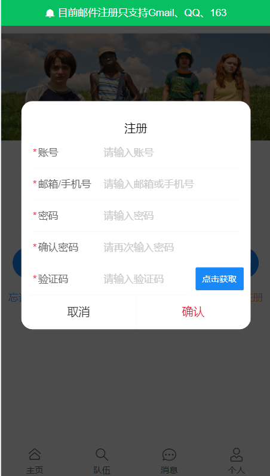

# 遇见伙伴 -- MeetFriends
> 一个帮助用户找到志同道合伙伴的社交 APP

## 项目简介
在快节奏的现代社会，找到志同道合的朋友变得越来越困难。**MeetFriends** 应运而生，致力于为用户打造一个专属的社交圈子，让你能够轻松遇见与你心灵契合的伙伴。

**MeetFriends** 通过个性化的标签搜索与“心动模式”匹配，帮助用户找到适合自己的社交圈。心动模式不仅仅是简单的匹配，而是通过先进的编辑距离算法，深度挖掘用户标签背后的潜在联系，精准推荐与你产生共鸣的用户。你还可以创建或加入队伍，与志同道合的朋友畅聊。

前端代码参考： [meetFriends-front-master ]( https://github.com/lhf2003/meetFriends-front-master )
在线访问地址： [meetFriends]( http://meetfei.cn )
## 技术栈
- **Java 8** 
- **Spring Boot 2**
- **Mybatis Plus**: 简化数据库操作 
- **Redis**: 用于缓存及分布式 Session 管理，GEO 实现实现计算用户位置距离
- **Redisson**: 实现分布式锁 
- **WebSokcet**：实现聊天室
- **华为云 OBS**: 用于文件存储服务 
- **Knife 4 j**: 管理 API 文档
- **WebSocket**：根据该协议实现实时聊天
使用的工具包
- lombok
- hutool
- common 3
- Gson
## 功能特性
- **模拟大量数据场景**: 使用 `CompletableFuture` 异步添加百万条假数据，充分测试系统在大数据量下的性能表现，确保其稳定性。
- **缓存预热**: 通过 `Spring Scheduled` 定时任务预热用户数据，提升系统响应速度。
- **分布式 Session 管理**: 基于 Redis 实现用户登录状态的存储和管理，确保系统的安全性与访问效率。
- **分布式锁**: 使用 Redisson 实现分布式锁，提高系统并发处理能力。
- **心动匹配算法**: 基于编辑距离算法计算用户标签相似度，智能推荐志同道合的朋友。
- **关注/粉丝**：管理关注列表和粉丝列表
- **聊天室**：可以与关注用户实时聊天
- **位置距离**：显示与其他用户的位置距离

## 未来展望
- **更多个性化推荐**: 进一步优化匹配算法，提升用户体验。
- **添加群聊**：使队伍成员能够更好的交流
- **发帖**：让伙伴们随时随地写文章

## 部分页面展示

